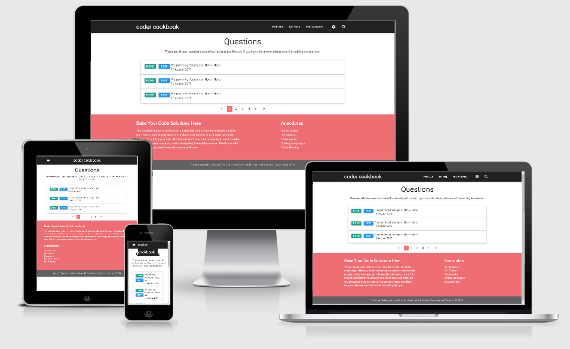

# Coders Cookbook

A forum for sharing anecdotes (recipes) to common coding problems.

Displayed data will include a Question describing a problem the user who
posted the question has come across during their coursework.

Displayed data will include the anecdote (recipe) the user followed to
solve the problem.

Although the app allows anyone to edit questions and answers presently
the idea is that the user who initially posted the question would
ultimately provide the answer once it becomes known to them. This is to
circumvent long scrolling message board type scenarios often seen in
apps such as Slack. It is assumed the user will use all sorts of apps
and even enquiries with tutors while searching for solutions to the
issue they are confronted with.

Ultimately, the original person who
posted the question should follow through by posting a detailed answer
to the question that involves all of the necessary steps they took to
resolve the problem the question posed.

Simply put, the cookbook is simply a library of issues reported by
students and the solutions they personally used to over come them.

Hosted on 
[Heroku Pages](https://decoder-cookbook.herokuapp.com/get_index)
Repository on
[GitHub](https://github.com/Jmcclain0129/decoder_cookbook)

## License

The project is shared for use with the [GNU General Public License v3](https://github.com/Pattern-Projects/oireachtas-ifd-project/blob/master/LICENSE)

>   This program is free software: you can redistribute it and/or modify
    it under the terms of the GNU General Public License as published by
    the Free Software Foundation, either version 3 of the License, or
    (at your option) any later version.

## UX




### Users 
Expected users of the website include students enrolled in the Code
Institute Fullstack Developers course. They come to the website with
questions in need of answering.

They are asked to pay it forward by leaving a recipe they used to solve
an unrelated problem. This way over time the website will become a very
valuable research resource for debugging issues encountered in their
coursework.

### User Stories
1. A new student is having difficulty accessing AWS Cloud9 environment
   and uses one of the recipes to learn how to navigate the the vocuream
   workbench to gain access. 
2. A tutor has taken a question from a student online through the
   courses tutor tab. The tutor informs the student the answer is
   available in the cookbook and advises they have a look there.
3. A student finds a recipe that helps them overcome an issue they have
   spent hours trying to resolve. Their so happy with the results they
   decide to post their own recipe for success.

### Design
Website Logo - Text Based

- Colour scheme consists exclusively through Materialize colour schema
  -  Navbar = grey darken-4:
      `#212121`
  -  Done btn teal lighten-1 btn-large:
      `#26a69a`
  -  Edit btn blue btn-large:
      `#2196F3`:
  -  Main Footer = red lighten-2:
      `#e57373`
  -  Bottom Footer grey darken-1:
      `#757575`
     
- roboto font used throughout the website
    - font-family: 'Roboto', 'helvetica' sans-serif;

### Mockups
The web app is a multi page with different displays given for different
functions:
- [Admins - add/edit/delete - courses](https://decoder-cookbook.herokuapp.com/get_categories)
- [Admins - add/edit/delete - modules](https://decoder-cookbook.herokuapp.com/get_modules)
- [Admins - add/edit/delete - units](https://decoder-cookbook.herokuapp.com/get_units)
- [Students View Questions](https://decoder-cookbook.herokuapp.com/get_tasks)
- [Students Create Questions](https://decoder-cookbook.herokuapp.com/add_tasks)
- [Students Create Get Advise](https://decoder-cookbook.herokuapp.com/soundadvice)


## Features

Features planned, implemented and outlined for later development 

### Planned Features
- Documentation - ReadMe File, Licence & Mockups
- Flask Python focused development
- Data input from forms
- Page refreshes
- Dynamic content switching by house
  -   Course
  -   Modules
  -   Units
- Pagination - Pending
- Breadcrumbs - Pending
- Colour Scheme
- Custom Logo - Pending
- Favicon - Pending
- Jasmine Testing - Pending
- Materialize - HTML, CSS Framework Grid System - Columns and Rows
    - Cards
    - Icons
    - Buttons
    - Image Carousel
    - Collapsible Table
    - Popout Cells
- Responsive design - Mobile First
- UX elements
    - User Flow
    - Animations
    - Transitions
- Accesibility
- Git - Version Control System
- GitHub - Remote Repository
- Deployed - Hosted on Heroku Pages

### Existing Features
- Documentation - ReadMe File, Licence & Mockups
- Flask Python focused development
- Data input from forms
- Page refreshes
- Dynamic content switching by house
  -   Course
  -   Modules
  -   Units
- Colour Scheme
- Materialize - HTML, CSS Framework Grid System - Columns and Rows
    - Cards
    - Icons
    - Buttons
    - Image Carousel
    - Collapsible Table
    - Popout Cells
- Responsive design - Mobile First
- UX elements
    - User Flow
    - Animations
    - Transitions
- Accesibility
- Git - Version Control System
- GitHub - Remote Repository
- Deployed - Hosted on Heroku Pages
- Cloud Database - MongoDB


### Features Left to Implement
- Dynamic content switching by house
  -   Course
  -   Modules
  -   Units
- Pagination
- Breadcrumbs
- Custom Logo
- Favicon
- Jasmine Testing
- Search
  - by keyword
  - by module, course or unit
- Login by user type
  -   Roles and Permissions

## Technologies Used

This project makes use of:
- [HTML](https://developer.mozilla.org/en-US/docs/Web/HTML)
    - HTML for strucutre
- [CSS](https://developer.mozilla.org/en-US/docs/Web/CSS)
    - CSS for Styling
- [JavaScript](https://www.w3schools.com/jsref/)
    - **JavaScript** for application controller
- [JQuery](https://jquery.com)
    - The project uses **JQuery** to simplify DOM manipulation.
- [Google Chrome](https://www.google.com/chrome/)
    - Used for browser and dev tools
- [Mozilla Firefox](https://www.mozilla.org/en-US/firefox/new)
    - Used for browser and dev tools
- [Google](https://www.google.com/)
    - **Google** was used for research.
- [Materialize v0.100.2](https://materializecss.com/)
    - HTML and CSS Framework from **Bootstrap**
- [PyCharm](https://www.jetbrains.com/pycharm/) This project was built
  using JetBrains **PyCharm** IDE
- [Git](https://git-scm.com/)
    - **Git** used for Version Control
- [GitHub](https://github.com/)
    - Repository hosted on **GitHub**
- [Heroku](https://decoder-cookbook.herokuapp.com/get_index) Website
  hosted on **Heroku**
- [MongoDB Atlas API](https://cloud.mongodb.com)
  -   Data collected from the **Atlas API**
- [Jinja](https://cdnjs.com/libraries/jasmine)
  -   Page extensions with **Jinja**
- [Am I Responsive](http://ami.responsivedesign.is)
    - Testing responsiveness of the website

## Testing

The site was tested through a number of means.

### Testing of this site was done manually using desktop, tablet and mobile devices. Corrections were made to improve responsiveness. More work needs to be done for site to be fully responsive.

1. Tested PC version using google chrome inspect tool
2. Tested Mobile and Tablet versions manually by visiting each page

Alternatively:

1. Visit the hosted version of the
   [website](https://decoder-cookbook.herokuapp.com/get_index)

Tests concluded site is not fully responsive in mobile displays but are
compliant in tablet and pc.

### User Stories
1. A student wants to check to see if a recipe exists for a bug they
   have encountered.
   -  From the Q & A page the user can sift through questions raised in
      hopes of finding a solution. Currently the only option is to
      scroll through the existing questions. A future version will allow
      page filtering so the student can sort by course, module or unit
      to see all questions related to each of the respective categories.
      Furthermore, a search feature will be implemented to allow the
      student to search the tasks db which houses all questions and
      answers data
2. A tutor can publish recipes to common issues they answer for students
   so that in future student interactions they can direct the student to
   their solution published in the cookbook
   -  Just as students would the tutor can access the questions form to
      lodge a problem question and use the same form in edit mode to
      submit the recipe needed to solve the problem raised by the
      initial question.
3. A student can review advice and tips related to various aspects of
   the course work they are undertaking. On the Sound Advise page they
   will find helpful hints and tips necessary to successfully navigate
   the course.

## Deployment

The project is hosted on
[Heorku](https://decoder-cookbook.herokuapp.com/get_index)

The process involved:
- Host a git repository on GitHub. Explained [here](https://help.github.com/en/articles/create-a-repo).
- The root folder contains README.md and index.html files
- On GitHub repository settings page move to GitHub Pages section
 
To deploy your own version of the website:
- Have git installed
- Visit the [repository]([GitHub](https://github.com/Jmcclain0129/decoder_cookbook))
- Click 'Clone or download' and copy the code for http
- Open your chosen IDE (Cloud9, VS Code, etc.)
- Open a terminal in your root directory
- Type 'git clone ' followed by the code taken from github repository
    - ```git clone https://github.com/Pattern-Projects/oireachtas-ifd-project.git```
- When this completes you have your own version of the website
    - Feel free to make any changes to it
- The website can be run by opening one of the HTML files within a web browser
- Visit the link provided
- Your website with any made changes will appear
- Saved changes to the website will appear here after refreshing the page

The benefits of hosting your website on GitHub pages is that any pushed changes to your project will automatically update the website. Development branches can be created and merged to the master when complete.

It may take a moment for changes to appear on the hosted website.

During development the site is written in PyCharm. It is run using Live
Server plugin for PyCharm.

## Known Bugs

- Site not responsive on smallest screens
- Picklist on the add_task form is pulling data from Mongodb units
  collection as it should be
- Links in footer static except for Sound Advice


## Credits

### Content
The text on the website has been written by the web designer:

### Media
The images for the website are taken from:
- [Index Slide 1](https://getthematic.com/wp-content/uploads/2018/06/Screen-Shot-2018-06-08-at-4.11.36-PM.png)
- [Index Slide 2](https://tvup.media/wp-content/uploads/2019/07/0_HICLyAdNSIyT0ODU.jpg)

### Acknowledgements
Thank you to the following for inspiration, motivation and the direction I needed:

- Seun Owonikoko    @seun_mentor
- Simen Daehlin     @Eventyret_mentor
- Michael Park      @michael_ci
- Niel McEwen       @niel_ci
- Code InstituteCode Institute